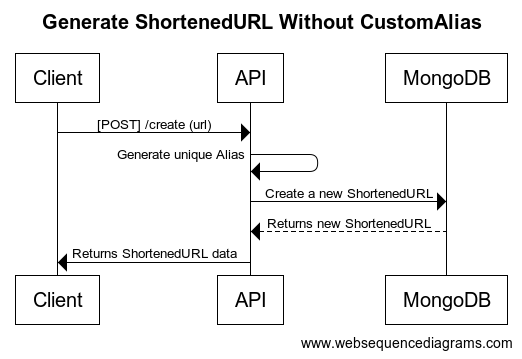
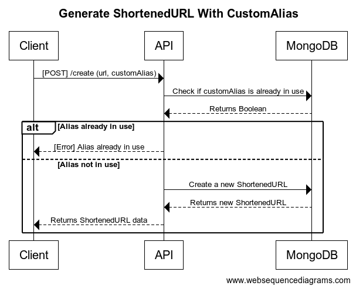
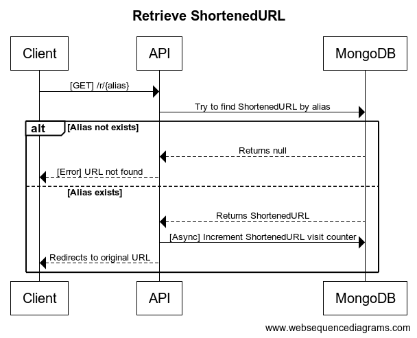
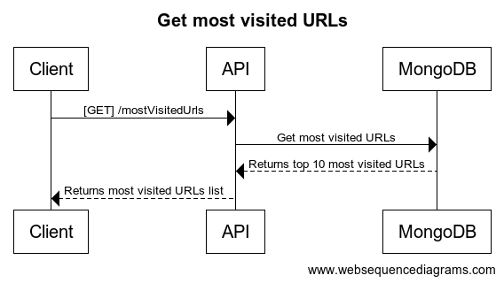

# Ferramentas utilizadas

## Algoritmo HiLo:

O algoritmo HiLo é um método simples para gerar números sequenciais únicos. Ele funciona armazenando um valor de sequência atual (também conhecido como "alta" ou "Hi") e incrementando-o a cada vez que um número único é necessário. Quando o valor atual da sequência atinge o limite superior (também conhecido como "baixo" ou "Lo"), o algoritmo redefine o valor atual da sequência para um novo valor inicial e continua a gerar números sequenciais a partir daí.

Seguindo esta lógica, concatenamos o valor de Hi e Lo utilizando esta formula:

"(HI \* (VALOR MAXIMO DE LO + 1)) + LO"

Para gerar um número sequencial único que por fim é utilizado em uma função que converte este número em um código de 6 caracteres em Base62.

<br/>

## BackEnd:

<li>NodeJS</li>
<li>TypeScript</li>
<li>Express</li>
<li>Yup</li>
<li>MongoDB</li>

<br/>

## FrontEnd:

<li>ReactJS</li>
<li>TypeScript</li>
<li>Styled Components</li>
<li>Yup</li>
<li>Axios</li>
<li>ContextAPI</li>
<li>React Hook Forms</li>

<br/>

## EndPoints

<br/>

## Shorten URL (sem apelido customizado):

### Diagrama:



### Exemplo de Request:

```
POST http://127.0.0.1:8080/create
```

body:

```JSON
{
  "url": "http://www.bemobi.com.br"
}
```

201 - Response:

```JSON
{
   "alias": "wzja5Cg",
    "originalUrl": "http://www.bemobi.com.br",
    "shortenedRedirectUrl": "http://127.0.0.1:8080/r/wzja5Cg",
    "statistics": {
        "time_taken": "35ms"
    }
}
```

<br/>
<br/>
<br/>

## Shorten URL (Com apelido customizado):

### Diagrama:



### Exemplo de Request:

```
POST http://127.0.0.1:8080/create
```

body:

```JSON
{
  "url": "http://www.bemobi.com.br",
  "customAlias": "bemobi"
}
```

201 - Response:

```JSON
{
   "alias": "bemobi",
    "originalUrl": "http://www.bemobi.com.br",
    "shortenedRedirectUrl": "http://127.0.0.1:8080/r/bemobi",
    "statistics": {
        "time_taken": "46ms"
    }
}
```

400 - Response:

```JSON
{
    "alias": "bemobi",
    "description": "CUSTOM ALIAS ALREADY EXISTS",
    "err_code": "001"
}
```

<br/>
<br/>
<br/>

## Retrieve URL:

### Diagrama:



### Exemplo de Request:

```
POST http://127.0.0.1:8080/r/bemobi
```

200 - response:

```
Redirect To "http://www.bemobi.com.br"
```

404 - Response:

```JSON
{
    "description": "SHORTENED URL NOT FOUND",
    "err_code": "002"
}
```

<br/>
<br/>
<br/>

## Most visited URLs:

### Diagrama:



### Exemplo de Request:

```
GET http://127.0.0.1:8080/mostVisitedUrls
```

200 - Response:

```JSON
[
    {
        "_id": "64358c68c89cff243b2063a8",
        "alias": "bemobi",
        "url": "http://www.bemobi.com.br",
        "createdAt": "2023-04-11T16:35:52.256Z",
        "visitCount": 23
    },
    {
        "_id": "6434941a0d27cc8d2e043057",
        "alias": "url2",
        "url": "http://teste.br",
        "createdAt": "2023-04-10T22:56:26.909Z",
        "visitCount": 17
    },
    {...}
]
```
